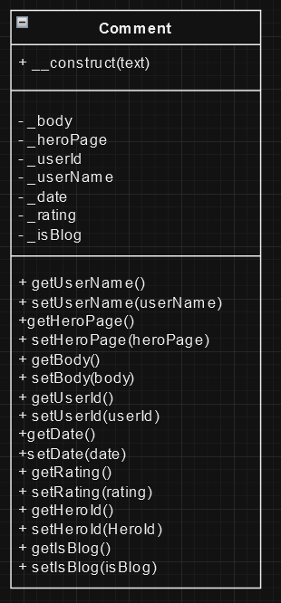
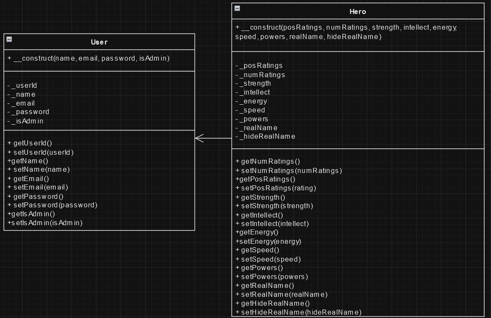
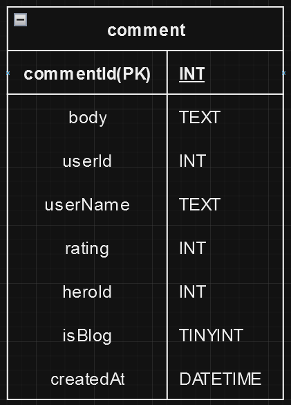
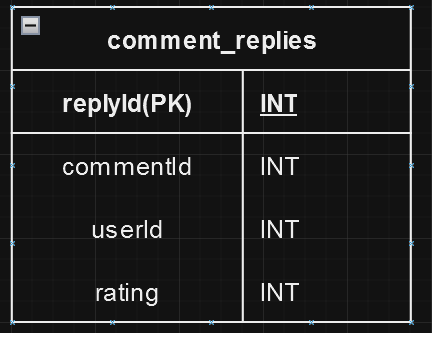
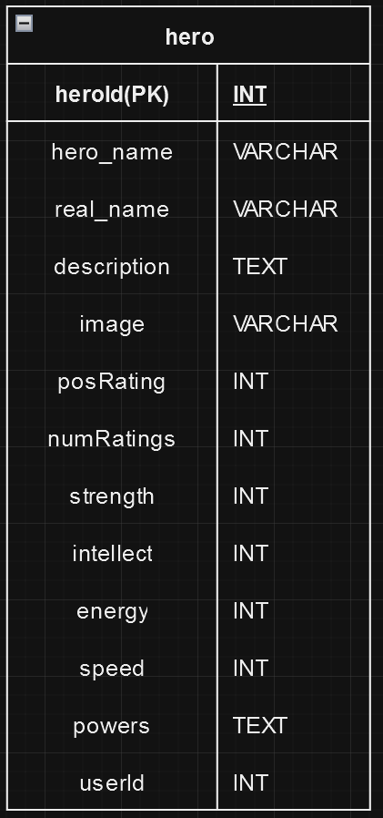
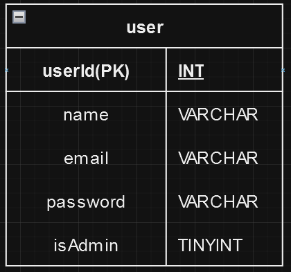
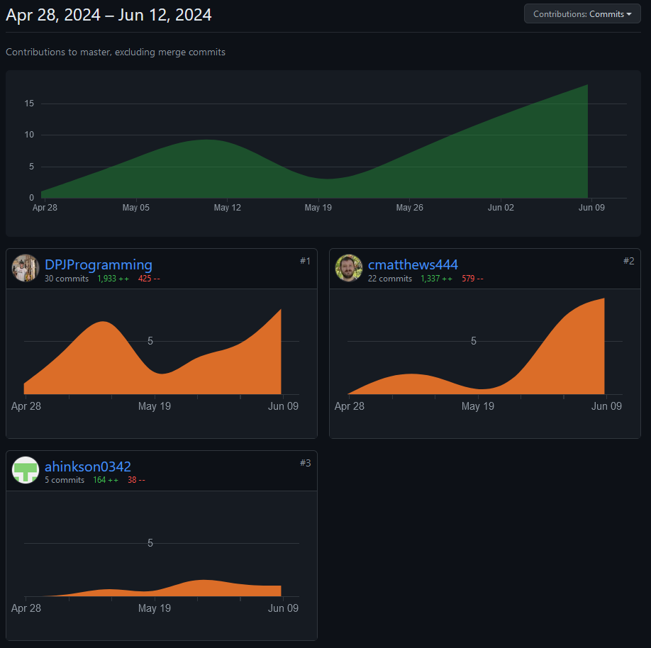

# RottenHeroes
Rotten Heroes is a superhero rating website used to provide a space where superhero fans can rate their
favorite and/or least favorite heroes, along with interact with hero profiles by leaving comments / 
reviews, and the heroes can post blog posts to update their fans on current statuses and updates.

## Authors

Colton Matthews - Developer
David Jarvis - Developer
Andrew Hinkson - Developer

## Project Requirements
**Separates all database/business logic using the MVC pattern.**
- All of our main site pages including the .html pages and header are in the proper views directory.

**Routes all URLs and leverages a templating language using the Fat-Free framework.**

- Minizied routing to the Index file while using the controller to do the heavy lifting and using 
validate.php file to handle the needed validation.

**Has a clearly defined database layer using PDO and prepared statements.**

- We have many prepared statements being used, We have multiple data-layer files that handle this.

**Data can be added and viewed.**

- Users can add comments onto their favorite heros, and new heros can create accounts adding their card 
to the front page which can then be commented and bloged on. This is done through the PDO statements.

**Has a history of commits from both team members to a Git repository. Commits are clearly commented.**

- History of commits from each teammate are visible from github repository, all are labeled with an appropriate message.

**Teammates commits and work can be seen in full from the Github contributions.**

- Commits are tracked through the GitHub repository, showing history of all commits and what was changed.

**Uses OOP, and utilizes multiple classes, including at least one inheritance relationship.**

- Used three classes; Comment, Hero, and User, where Hero extends User because a hero in this implementation has all 
the same properties and methods as a user, plus some.

**Contains full Docblocks for all PHP files and follows PEAR standards.**

- All PHP files are documented and following PEAR standards to the best of our abilites.

**Has full validation on the server side through PHP.**

- All forms are validated within controller using PHP before being submitted to the database.

**All code is clean, clear, and well-commented. DRY (Don't Repeat Yourself) is practiced.**

- Code is well documented, precisely named, and well organized to optimize readability, even for those who have not 
seen or worked on the project in the past.

**Your submission is professional and shows adequate effort for a final project in a full-stack web 
development course.**

- We Completed the project according to the requirements set forth when the project was assigned, and we took 
opportunities to explore other ideas that were not required within the original instructions.

# UML Class Diagram

# ER Database Diagram

# GitHub Commit Breakdown

